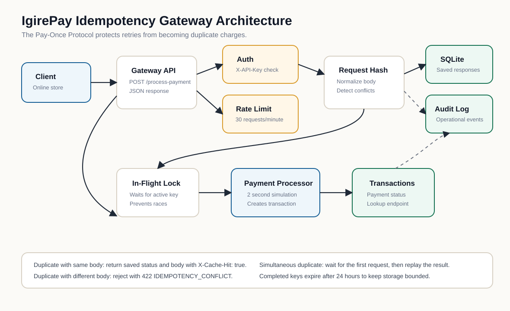

# Idempotency Gateway

Python implementation of IgirePay Technologies Ltd.'s Pay-Once Protocol.

This service prevents duplicate charges when a client retries a payment request after a timeout. The first request for an `Idempotency-Key` is processed and stored. Later identical requests with the same key return the original response immediately.

## Architecture Diagram



## Setup Instructions

Requirements:

- Python 3.10 or newer
- No external packages required

Run the server:

```powershell
python app.py
```

Open the browser demo:

```text
http://127.0.0.1:5000
```

Run tests:

```powershell
python -m unittest -v
```

The demo API key is:

```text
test_secret_key
```

## API Documentation

### POST /process-payment

Processes a mock payment exactly once per idempotency key.

Required headers:

```text
Content-Type: application/json
X-API-Key: test_secret_key
Idempotency-Key: <unique-client-generated-key>
```

Request body:

```json
{
  "amount": 100,
  "currency": "GHS"
}
```

First request:

```powershell
curl -i -X POST http://127.0.0.1:5000/process-payment `
  -H "Content-Type: application/json" `
  -H "X-API-Key: test_secret_key" `
  -H "Idempotency-Key: order-1001" `
  -d "{\"amount\":100,\"currency\":\"GHS\"}"
```

Successful response:

```http
HTTP/1.0 201 Created
X-Cache-Hit: false
X-Idempotency-TTL-Seconds: 86400
```

```json
{
  "message": "Charged 100 GHS",
  "transaction": {
    "transaction_id": "txn_...",
    "amount": 100.0,
    "currency": "GHS",
    "status": "charged",
    "created_at": "..."
  }
}
```

Duplicate request:

```powershell
curl -i -X POST http://127.0.0.1:5000/process-payment `
  -H "Content-Type: application/json" `
  -H "X-API-Key: test_secret_key" `
  -H "Idempotency-Key: order-1001" `
  -d "{\"amount\":100,\"currency\":\"GHS\"}"
```

Duplicate response:

```http
HTTP/1.0 201 Created
X-Cache-Hit: true
```

The response body and status code are the same as the first successful request. The payment processor is not called again, so there is no second processing delay.

Same key with a different body:

```powershell
curl -i -X POST http://127.0.0.1:5000/process-payment `
  -H "Content-Type: application/json" `
  -H "X-API-Key: test_secret_key" `
  -H "Idempotency-Key: order-1001" `
  -d "{\"amount\":500,\"currency\":\"GHS\"}"
```

Conflict response:

```http
HTTP/1.0 422 Unprocessable Entity
```

```json
{
  "error": {
    "code": "IDEMPOTENCY_CONFLICT",
    "message": "Idempotency key already used for a different request body."
  }
}
```

### GET /payments/<transaction_id>

Returns the status of one payment transaction.

```powershell
curl -i http://127.0.0.1:5000/payments/txn_example `
  -H "X-API-Key: test_secret_key"
```

### GET /transactions

Returns recent processed transactions.

```powershell
curl -i http://127.0.0.1:5000/transactions `
  -H "X-API-Key: test_secret_key"
```

### GET /audit-logs

Returns recent request audit events.

```powershell
curl -i http://127.0.0.1:5000/audit-logs `
  -H "X-API-Key: test_secret_key"
```

### GET /health

Returns service health. This endpoint does not require an API key.

```powershell
curl http://127.0.0.1:5000/health
```

## Added Features And Why They Matter

### SQLite Persistence

Idempotency records and transactions are saved in `gateway.db`.

Why it matters: an in-memory dictionary loses all keys when the server restarts. A payment processor must remember completed idempotency keys after a crash or redeploy, otherwise a retry after restart could double-charge a customer.

### Payment Status Endpoint

`GET /payments/<transaction_id>` lets clients check the status of a payment.

Why it matters: when a client times out, it should be able to ask the gateway what happened instead of blindly retrying forever.

### Audit Logging

The system logs payment processing, cache hits, conflicts, unauthorized requests, validation failures, and rate-limit events.

Why it matters: fintech teams need audit trails for customer disputes, fraud investigation, debugging, and compliance reviews.

### Expiration Cleanup

Completed idempotency records expire after 24 hours. Expired records are removed during request handling.

Why it matters: idempotency keys should not grow forever. A clear retention window keeps storage bounded while still protecting normal retry behavior.

### API Authentication

Sensitive endpoints require:

```text
X-API-Key: test_secret_key
```

Why it matters: payment endpoints should never be open to anonymous callers. Even a simple API key shows that the gateway separates public health checks from protected payment operations.

### Rate Limiting

The API limits each client IP to 30 payment attempts per minute.

Why it matters: rate limiting reduces abuse, accidental retry storms, and brute-force attempts against idempotency keys.

### Consistent Error Format

Errors use:

```json
{
  "error": {
    "code": "ERROR_CODE",
    "message": "Human readable message"
  }
}
```

Why it matters: clients can safely write code against stable error codes while still showing readable messages to developers.

## User Experience

The browser page at `http://127.0.0.1:5000` includes a magazine-style service overview, working navigation, a live API test form, developer help content, contact information, and a footer. It uses the IgirePay logo from `img/logo-igire.png`.

## Design Decisions

- The project uses only the Python standard library so reviewers can run it immediately with `python app.py`.
- SQLite is used instead of an external database so persistence works without setup. In production this could be PostgreSQL, Redis, or another shared durable store.
- In-flight request coordination remains in memory with `threading.Event` because it only needs to coordinate requests currently handled by this running process.
- Request bodies are normalized before hashing. This prevents harmless JSON formatting or field ordering differences from breaking duplicate detection.
- The saved response body and status code are replayed exactly for duplicate requests.

## Pre-Submission Checklist

- Repository should be public.
- Run command works: `python app.py`.
- Test command works: `python -m unittest -v`.
- No React, Node, generated dependency folders, or local database files are required in the repo.
- README contains the architecture diagram, setup instructions, API docs, design decisions, and the extra production safety features.
